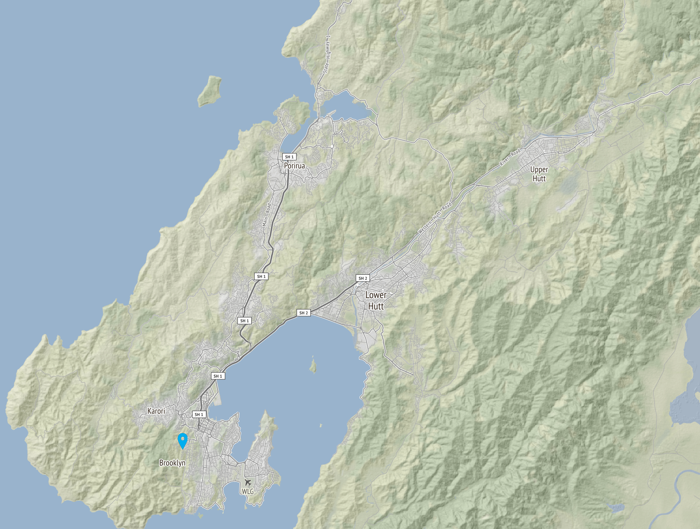

# gomapper (working-title)

A small package to generate maps for a given bounds; currently using a tile map service like OSM.

Can currently also add markers onto that map. As far as I can tell this is most of the functionality of `map180`.

## Example:

This code:
```go
htg, err := NewHttpTileGetter("https://static.geonet.org.nz/osm/v2/{z}/{x}/{y}.png")
if err != nil {
	t.Log(err)
	t.Fatalf("NewHttpTileGetter returned error: %v", err)
}

llb = LonLatBounds{LonLat{174.608878, -41.030715}, LonLat{175.181755, -41.357773}},

gm := NewMapFromBounds(llb)

err = gm.SetTileBaseLayer(12, htg)
if err != nil {
	t.Fatalf("SetTileBaseLayer returned error: %v", err)
}

tileImage, err := LoadMarkerImage("images/marker.png")
if err != nil {
	t.Fatalf("LoadMarkerImage failed: %v", err)
}

markers := []LonLat{{174.758025, -41.308918}}

err = gm.DrawMarkers(markers, "markers", tileImage)
if err != nil {
	t.Fatalf("DrawMarkers failed: %v", err)
}

b, err := gm.ToPNG()
if err != nil {
	t.Fatalf("toPNG failed: %v", err)
}

err = ioutil.WriteFile(fmt.Sprintf("testout/TestTileBaseLayerMap%d.png", i), b, 0644)
if err != nil {
	t.Fatalf("couldn't write file: %v", err)
}
```

Will generate this image:


